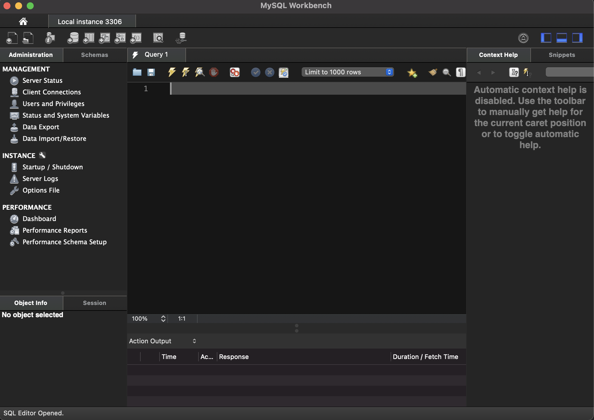

# 8.1. MySQL & workbench

MySQL and workbench often are difficult to install. If you didn't manage to connect MySQL to workbench, follow these steps:

## How to know if MySQL and Workbench don't work:

- 8.1.2.  Open MySQLWorkbench
- 8.1.3. Click on the `+` button
- 8.2.3. Create a connection (your password will probably be admin)

- 8.1.4. After creating it, if you see somehting like (`NO CONNECTION` warning):

    **go to:** ➡️ https://github.com/breogann/data-pre-reqs/blob/master/08-mysql-and-workbench/08.2-reinstalling.md

- 8.1.4. However, if what you see is this (no warning):

    **go to:** ➡️ https://github.com/breogann/data-pre-reqs/blob/master/08-mysql-and-workbench/08.3-hands-on-workbench.md

