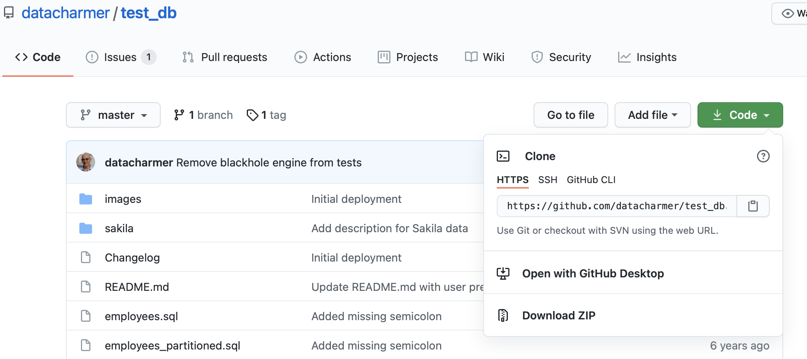
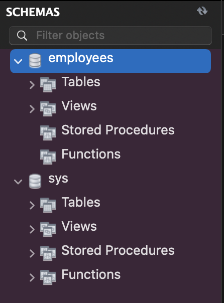

# 8.2. Hands-on workbench

Now that you have MySQL and Workbench working properly, let's try it out!

## 1. Import a database:

1.1. **Download**: https://github.com/datacharmer/test_db. Click on code and download as ZIP.



1.2. Navigate to the ZIP file and **unzip** it:


```bash
cd ; cd Downloads
unzip test_db-master.zip
cd test_db-master/
```

1.3. **Load it** into SQL:

```bash
mysql -t -u root -p  < employees.sql
```

## 2. Check it has been imported

Refresh. Click on the top right corner (two circling arrows)



You should now see the employees schema.

If you don't, another way to it is:
`File > Run SQL script > employees.sql`


Hit run. Then refresh.

## 2. Query something

Write:
```sql
USE employees;
SELECT * FROM departments;
```
and hit the ⚡️ icon. 

You should see:


## 3. MySQL & Workbench work 🎉
