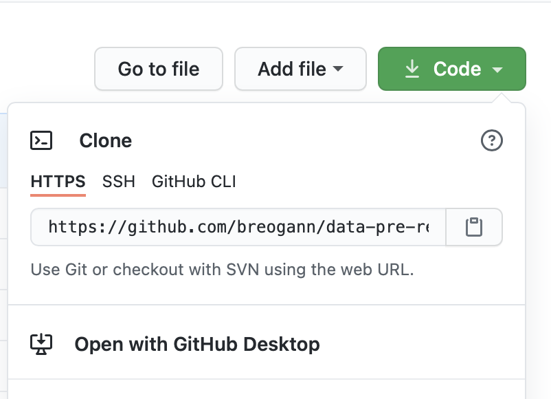

# Create a repo

1. Go to github.com
2. Create a repo with the name **first-repo**: 
`Profile > Your repositories > New > Add README.md > Create repository`
3. Clone your own repository: go here

and copy that link.
4. Go into your directory
    ```bash
    git clone THE_LINK_YOU_COPIED
    cd your-repo
    git status
    ```
5. Create a file inside of it
    ```bash
    touch first-file.py
    ```
6. Add the files to git:
    ```bash
    git status
    ````
    You'll notice the file is on red.
    ```bash
    git add first-file.py
    git status #yes, again. Always git status, all the time
    ```
    Notice how the file is now green. Now git is tracking the file!

7. Git commit:
    ```bash
    git commit -m "My first commit, yay!"
    ````
8. Git push:
    ```bash
    git push origin main
    ````

* It didn't work? try: git push origin master

9. Get the url of your repo:
    ```bash
    git remote show origin
    ````

10. Copy the url and:

    ```bash
    open your_url
    ```

This way, your machine will open your repository on github. You can see your own commit and the file you created.

