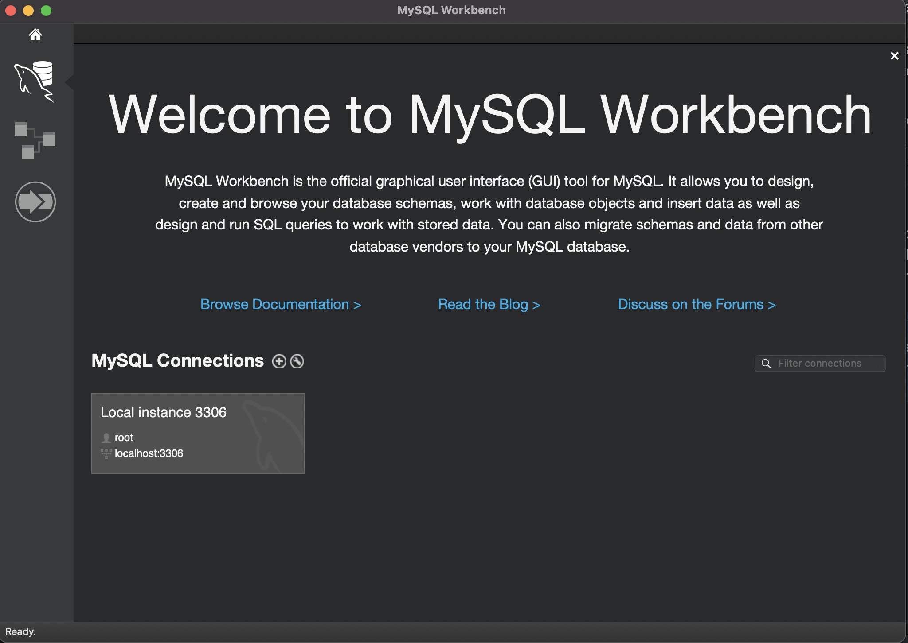

# 8.2. Reinstalling MySQL & Workbench

### 1. Uninstall

1.0. Uninstall **Workbench**: locate MySQL Workbench in the Applications folder, right-click, and select Move to Trash.


1.1. Uninstall **MySQL**
```bash
brew remove mysql
brew cleanup
```

1.2. Unload previous MySQL Auto-Login
```bash
launchctl unload -w ~/Library/LaunchAgents/homebrew.mxcl.mysql.plist
```

_You might get "Unload failed: 5: Input/output error". Ignore it._

1.3. Remove files: it'll ask for your admin password.
```bash
sudo rm /usr/local/mysql
sudo rm -rf /usr/local/var/mysql
sudo rm -rf /usr/local/mysql*
sudo rm ~/Library/LaunchAgents/homebrew.mxcl.mysql.plist
sudo rm -rf /Library/StartupItems/MySQLCOM
sudo rm -rf /Library/PreferencePanes/My*
```

_You might get: "No such file or directory" Ignore it._

1.4. Remove previous configuration: it'll ask again for your admin password.
```bash
rm -rf ~/Library/PreferencePanes/My*
sudo rm -rf /Library/Receipts/mysql*
sudo rm -rf /Library/Receipts/MySQL*
sudo rm -rf /private/var/db/receipts/*mysql*
```
_You might get: "no matches found". Ignore it._

1.5. **Restart** your computer just to ensure any MySQL processes are killed

1.6. Try to run mysql, it shouldn't work: 
```bash
mysql.server start
```


### 2. Re-installing MySQL
```bash
brew install mysql #Install
mysql.server start #Start
````
Run the following commands one by one:

```bash
sudo mysql -u root -p #Just hit enter when prompted to input your password. If error, try again with admin as your password
USE mysql;
ALTER USER 'root'@'localhost' IDENTIFIED WITH mysql_native_password BY 'admin'; #Substitute 'admin' by your password
FLUSH PRIVILEGES;
QUIT;
```

#### 2.1. Did it give you this **error**?: "The server quit without updating PID file".

Do:
```bash
sudo killall mysqld
````
Then:
```bash
whoami
```
That's your username. Now, you can substitute:

```bash
brew install mysql #Install
mysql.server start #Start
sudo mysql -u root -p #Enter admin as your password
````
Run the following commands one by one:
```bash
USE mysql;
ALTER USER 'YOUR_USUERNAME_GOES_HERES'@'localhost' IDENTIFIED WITH mysql_native_password BY 'admin';
FLUSH PRIVILEGES;
QUIT;
```
### 3. Download an install workbench
It is important you download the version **8.0.20**, otherwise there might be conflicts.

https://downloads.mysql.com/archives/workbench/

It should all be set now! 


### 4. How do you know everything's okay?

4.1. **Open MySQL** workbench from your application folder by right-clicking. 

4.2. **Create a connection**: You should go to the MySQL Connection section and if there is nothing below it, click on the `+` sign and create one. Name it whatever you want.

It might ask for a password. It will probably be 'admin'.



4.3. If you see this (no red warning on the bottom left), it's now working:


### 5. Doing a query

Go to ➡️ https://github.com/breogann/data-pre-reqs/blob/master/08-mysql-and-workbench/08.3-hands-on-workbench.md
#####

_Refs: https://gist.github.com/vitorbritto/0555879fe4414d18569d_